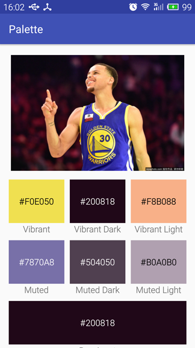
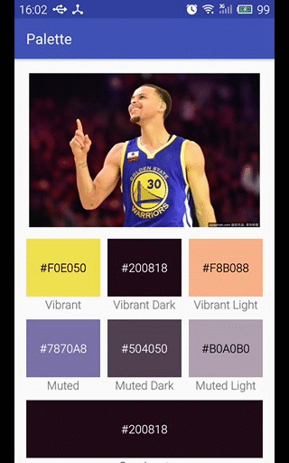
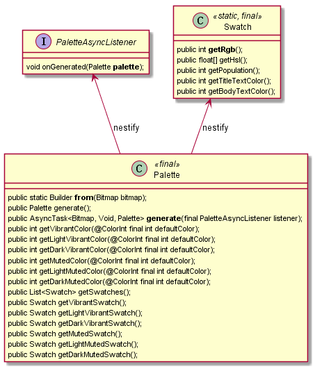

## 使用Palette调色板获取色块

Android中可以使用调色板Palette来获取图片中主要颜色，鲜艳或者柔和的颜色，或者其他的小色块Swatch。

Palette默认提取的颜色有：

```
Vibrant - 鲜艳色
Vibrant dark - 暗色
Vibrant light - 亮色

Muted - 柔和色
Muted dark - 暗色
Muted light - 亮色

Dominant - 主色
```

先上一张效果演示图片：



**1. 添加依赖库**

可以直接在Project Structure中搜索库依赖：palette，选择com.android.support域名下的库即可。

```
compile 'com.android.support:appcompat-v7:25.1.0'
compile 'com.android.support:palette-v7:25.1.0'
```

**2. 创建Palette对象**

Palette对象的创建是一个耗时操作，应该使用异步方式或者在线程中调用同步方式创建。当前推荐使用Builder模式来创建Palette实例：

同步创建方式

```
// Synchronous
Palette p = Palette.from(bitmap).generate();
```

异步创建方式

```
// Asynchronous
Palette.from(bitmap).generate(new Palette.PaletteAsyncListener() {
    @Override
    public void onGenerated(Palette palette) {
        // Use generated instance
    }
});
```

**3. Palette使用示例**

这里使用异步方式来创建Palette调色板，在回调方法onGenerated(Palette)中可以得到Palette对象。Swatch小色块若使用XML方式定义则布局代码会很长，这里使用代码方式来创建布局样式。

```
private void setPaletteColor(TextView tv, int color) {
    tv.setBackgroundColor(color);
    tv.setText(ColorUtils.toRGBHexString(color));
    tv.setTextColor(ColorUtils.parseBackgroundColor(color));
}

private void initPalette() {
    Drawable drawable = mPictureIv.getDrawable();
    Bitmap bitmap = drawableToBitmap(drawable);

    // Synchronous
    // mPalette = Palette.from(bitmap).generate();

    // Asynchronous
    Palette.from(bitmap).generate(new Palette.PaletteAsyncListener() {
        @Override
        public void onGenerated(Palette palette) {
            // Use generated instance
            int defaultColor = Color.parseColor("#b64242");

            int mVibrantColor = palette.getVibrantColor(defaultColor);
            int mDarkVibrantColor = palette.getDarkVibrantColor(defaultColor);
            int mLightVibrantColor = palette.getLightVibrantColor(defaultColor);
            int mMutedColor = palette.getMutedColor(defaultColor);
            int mDarkMutedColor = palette.getDarkMutedColor(defaultColor);
            int mLightMutedColor = palette.getLightMutedColor(defaultColor);

            setPaletteColor(mVibrantColorTv, mVibrantColor);
            setPaletteColor(mDarkVibrantColorTv, mDarkVibrantColor);
            setPaletteColor(mLightVibrantColorTv, mLightVibrantColor);
            setPaletteColor(mMutedColorTv, mMutedColor);
            setPaletteColor(mDarkMutedColorTv, mDarkMutedColor);
            setPaletteColor(mLightMutedColorTv, mLightMutedColor);

            // dominant color (主色)
            int mDominantColor = palette.getDominantColor(defaultColor);
            setPaletteColor(mDominantColorTv, mDominantColor);

            // Swatch - 色块 // 15种
            List<Palette.Swatch> mSwatchList = palette.getSwatches();
            Toast.makeText(MainActivity.this, "Swatch num: " + mSwatchList.size(), Toast.LENGTH_SHORT).show();
            int index = -1;
            LinearLayout mSwatchesContainer = null;
            LinearLayout.LayoutParams params;
            for (Palette.Swatch swatch : mSwatchList) {
                int color = swatch.getRgb();
                index++;

                if (index % 3 == 0) {
                    mSwatchesContainer = new LinearLayout(getApplicationContext());
                    mSwatchesContainer.setOrientation(LinearLayout.HORIZONTAL);
                    params = new LinearLayout.LayoutParams(
                            LinearLayout.LayoutParams.MATCH_PARENT,
                            LinearLayout.LayoutParams.WRAP_CONTENT
                    );
                    params.topMargin = (int) DisplayUtils.dp2px(getApplicationContext(), 10);
                    mContainerLayout.addView(mSwatchesContainer, params);       //
                }

                LinearLayout mSwatchContainer = new LinearLayout(getApplicationContext());
                mSwatchContainer.setOrientation(LinearLayout.VERTICAL);
                params = new LinearLayout.LayoutParams(0, LinearLayout.LayoutParams.WRAP_CONTENT);
                params.weight = 1;
                params.gravity = Gravity.CENTER;
                if (mSwatchesContainer != null) {
                    mSwatchesContainer.addView(mSwatchContainer, params);       //
                }

                TextView mColorTv = new TextView(getApplicationContext());
                mColorTv.setTextSize(TypedValue.COMPLEX_UNIT_SP, 16);
                setPaletteColor(mColorTv, color);           //
                mColorTv.setGravity(Gravity.CENTER);
                params = new LinearLayout.LayoutParams(
                        LinearLayout.LayoutParams.MATCH_PARENT,
                        (int) DisplayUtils.dp2px(getApplicationContext(), 80)
                );
                params.gravity = Gravity.CENTER;
                mSwatchContainer.addView(mColorTv, params);                 //

                TextView mColorNameTv = new TextView(getApplicationContext());
                mColorNameTv.setTextSize(TypedValue.COMPLEX_UNIT_SP, 16);
                mColorNameTv.setText("Swatch " + index);
                mColorNameTv.setGravity(Gravity.CENTER);
                mColorNameTv.setTextColor(Color.parseColor("#333333"));
                params = new LinearLayout.LayoutParams(
                        LinearLayout.LayoutParams.WRAP_CONTENT,
                        LinearLayout.LayoutParams.WRAP_CONTENT
                );
                params.gravity = Gravity.CENTER;
                mSwatchContainer.addView(mColorNameTv, params);
            }
        }
    });
}
```

Drawable转Bitmap的方法：

```
public static Bitmap drawableToBitmap(Drawable drawable) {
    Bitmap bitmap = Bitmap.createBitmap(
            drawable.getIntrinsicWidth(),
            drawable.getIntrinsicHeight(),
            drawable.getOpacity() != PixelFormat.OPAQUE ? Bitmap.Config.ARGB_8888 : Bitmap.Config.RGB_565);
    Canvas canvas = new Canvas(bitmap); // canvas -> bitmap
    //canvas.setBitmap(bitmap);
    drawable.setBounds(0, 0, drawable.getIntrinsicWidth(), drawable.getIntrinsicHeight());
    drawable.draw(canvas);      // drawable -> canvas
    return bitmap;  // drawable -> canvas -> bitmap
}
```

ColorUtils工具类中有如下几个方法：

public static String toRGBHexString(final int color) - 将int颜色值转成Hex颜色字符串(color -> #FF55FF)

public static int parseBackgroundColor(int color) - 通过分析背景色来决定当前文字的匹配颜色，使文字颜色自适应背景颜色

ColorUtils工具类是自己整理的用于颜色相关的操作方法，源代码如下：

```
public class ColorUtils {

    public static int parseBackgroundColor2(int color) {
        int counter = 0;
        counter += Color.red(color) >= 128 ? 1 : 0;
        counter += Color.green(color) >= 128 ? 1 : 0;
        counter += Color.blue(color) >= 128 ? 1 : 0;
        return counter >= 2 ? Color.BLACK : Color.WHITE;
    }

    // 通过分析背景色来决定当前文字的匹配颜色，使文字颜色自适应背景颜色
    public static int parseBackgroundColor(int color) {
        int red = Color.red(color);
        int green = Color.green(color);
        int blue = Color.blue(color);
        if (red >= 128 && green >= 128      // 三选二
                || red >= 128 && blue >= 128
                || green >= 128 && blue >= 128) {
            return Color.rgb(0, 0, 0);
        }
        return Color.rgb(255, 255, 255);
    }

    // #FF55FF => color
    // int color = Color.parseColor("#b64242");

    // color -> #FF55FF
    public static String toRGBHexString(final int color) {
        return toRGBHexString(Color.red(color), Color.green(color), Color.blue(color));
    }

    // (r,g,b) -> #FF55FF
    public static String toRGBHexString(int red, int green, int blue) {
        return toARGBHexString(-1, red, green, blue);
    }

    // default prefix: "#"
    // (a,r,g,b) -> #FF55FF55
    public static String toARGBHexString(int alpha, int red, int green, int blue) {
        return toARGBHexString("#", alpha, red, green, blue);
    }

    public static String toARGBHexString(String prefix, int alpha, int red, int green, int blue) {
        StringBuilder sb = new StringBuilder();
        sb.append(prefix);
        if (alpha != -1) {
            String mAlphaStr = Integer.toHexString(alpha);
            sb.append(mAlphaStr.length() == 1 ? "0" + mAlphaStr : mAlphaStr);
        }
        String mRedStr = Integer.toHexString(red);
        sb.append(mRedStr.length() == 1 ? "0" + mRedStr : mRedStr);
        String mGreenStr = Integer.toHexString(green);
        sb.append(mGreenStr.length() == 1 ? "0" + mGreenStr : mGreenStr);
        String mBlueStr = Integer.toHexString(blue);
        sb.append(mBlueStr.length() == 1 ? "0" + mBlueStr : mBlueStr);
        return sb.toString().toUpperCase();
    }

}
```

**4. 效果演示**



**5. Palette的UML类图关系**

Swatch是定义在Palette中的内部类

